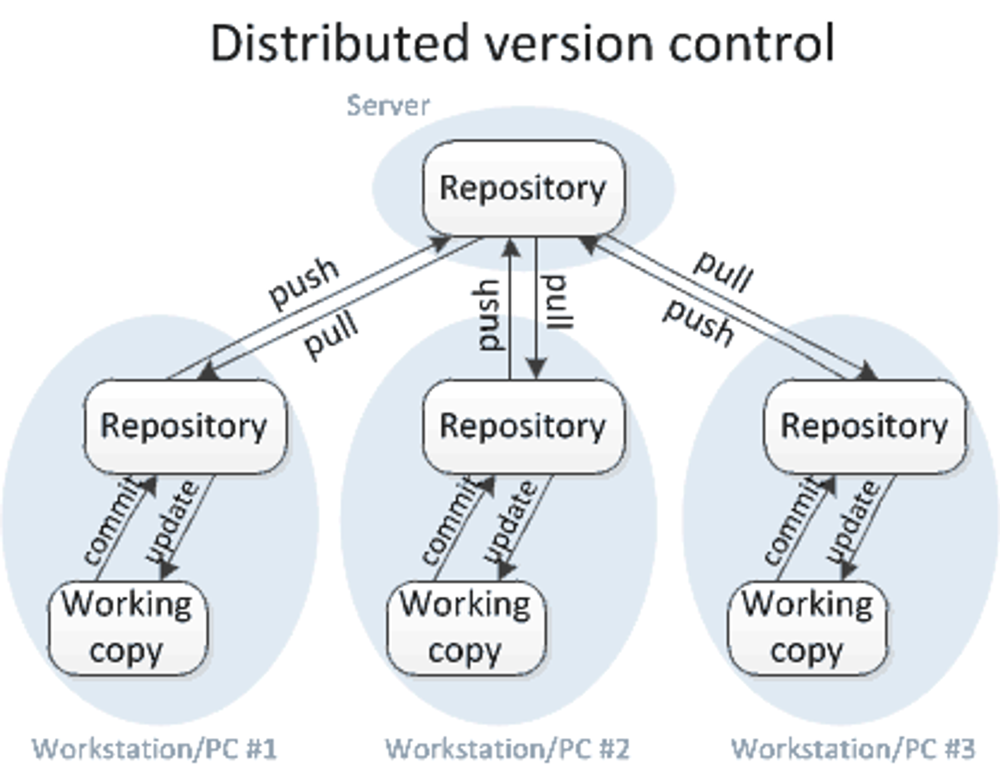
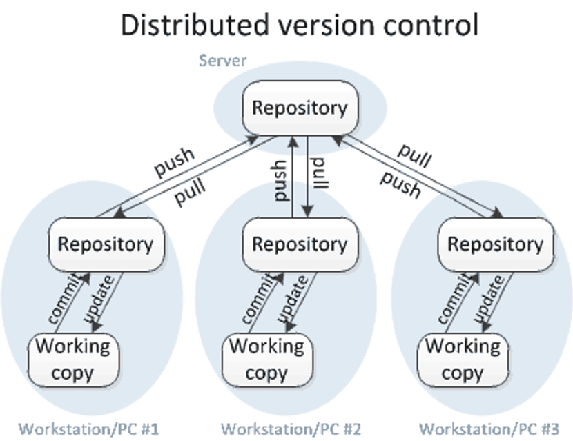
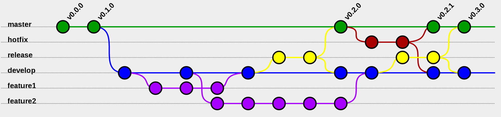
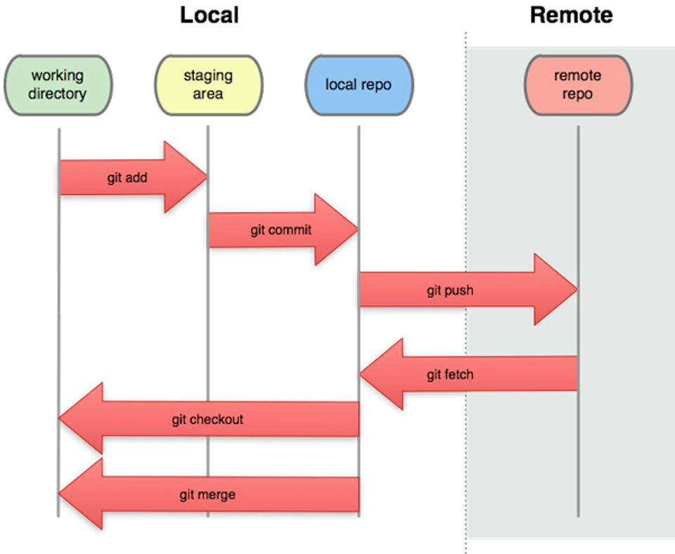

# Version Control Systems

- [What is a Version Control System?](#what-is-a-version-controlsystem)
- [Centralized Version Control Systems](#centralized-version-control-systems-svn)
- [Distributed Version Control System](#distributed-version-control-system-git)
- [Git](#git)
    - [Git Typical workflow](#git-typical-workflow)
- [Version control best practices](#version-control-best-practices)
- [Start your project](#start-your-project)

### **What is a Version Control System?**

Version control enables multiple people to simultaneously work on a single project. Each person edits his or her own
copy of the files and chooses when to share those changes with the rest of the team. Thus, temporary or partial edits by
one person do not interfere with another person's work. Version control also enables one person you to use multiple
computers to work on a project, so it is valuable even if you are working by yourself.

While centralized systems were the version control system of choice for nearly a decade, Git has surpassed them in
recent years. Unlike SVN, Git utilizes multiple repositories: a central repository and a series of local repositories.
Let's see which are the differences.

The main difference between centralized and distributed version control is the number of repositories. In centralized
version control, there is just one repository, and in distributed version control, there are multiple repositories.

### Centralized Version Control Systems [SVN]



Advantages:

- All the changes in the files are tracked under the centralized server.
- The centralized server includes all the information of versioned files, and list of clients that check out files from
  that central place.

In**centralized version control**, each user gets his or her own working copy, but there is just one central repository.
As soon as you commit, it is possible for your co-workers to update and to see your changes. For others to see your
changes, 2 things must happen:

- You commit
- They update

### Distributed Version Control System [git]



Distributed version control systems come into picture to overcome the drawback of centralized version control system.
The clients completely clone the repository including its full history. If any server dies, any of the client
repositories can be copied on to the server which help restore the server.

Every clone is considered as a full backup of all the data.

In**distributed version control**, each user gets his or her own repository*and*working copy. After you commit, others
have no access to your changes until you push your changes to the central repository. When you update, you do not get
others' changes unless you have first pulled those changes into your repository. For others to see your changes, 4
things must happen:

- You commit
- You push
- They pull
- They update

Notice that the commit and update commands only move changes between the working copy and the local repository, without
affecting any other repository. By contrast, the push and pull commands move changes between the local repository and
the central repository, without affecting your working copy.

### Git

Git provides support for non-linear development of the software. It supports quick branching and merging and also
includes tools for navigating and visualising a non-linear development history.

The repositories of GIT can be published via Hypertext Transfer Protocol (HTTP), File Transfer Protocol (FTP), or a Git
protocol over either a plain socket, or Secure Shell (ssh).

The **Git Flow** is the most known workflow on this list. It was created
by[Vincent Driessen in 2010](http://nvie.com/posts/a-successful-git-branching-model/)and it is based in two main
branches with infinite lifetime:

- **master**— this branch contains production code. All development code is merged into master in sometime.
- **develop**— this branch contains pre-production code. When the features are finished then they are merged into
  develop.

During the development cycle, a variety of supporting branches are used:

- **feature-***— feature branches are used to develop new features for the upcoming releases. May branch off from
  develop and must merge into develop.
- **hotfix-***— hotfix branches are necessary to act immediately upon an undesired status of master. May branch off from
  master and must merge into master anddevelop.
- **release-***— release branches support preparation of a new production release. They allow many minor bug to be fixed
  and preparation of meta-data for a release. May branch off from develop and must merge into master and develop.



#### Git Typical workflow



- `git clone <repo>`
- `git pull`
- As many times as desired:
    - Make local edits
    - Examine the local edits: `git status` and `git diff`
    - `git commit`
    - `git pull`
- `git pull`
- `git push`

Note that an invocation of `git pull` may force you to resolve a conflict. That's pretty much all you need to know,
besides how to clone an existing repository.

### **Version control best practices**

💡 **Use a descriptive commit message**

It only takes a moment to write a good commit message. This is useful when someone is examining the change,
because it indicates the purpose of the change. This is useful when someone is looking for changes related to a given
concept,
because they can search through the commit messages.

💡 **Make each commit a logical unit**

💡 **Avoid indiscriminate commits**

As a rule, you do not run `git commit -a` without supplying specific files to commit. If you supply no file names,
then these commands commit every changed file. You may have changes you did not intend to make permanent (such as
temporary debugging changes); even if not, this creates a single commit with multiple purposes.

When you want to commit your changes, to avoid accidentally committing more than intended, you always run the following
commands:

```bash
# Lists all the modified files
❯ git status

# Shows specific differences, helps me compose a commit message
❯ git diff

# Commits just the files I want
❯ git commit *file1* *file2* -m "*Descriptive commit message*"

```

💡 **Incorporate others' changes frequently**

Work with the most up-to-date version of the files as possible. That means that you should run `git pull`
or `git pull -r` very frequently.

When two people make conflicting edits simultaneously, then manual intervention is required to resolve the conflict. But
if someone else has already completed a change before you even start to edit, it is a huge waste of time to create, then
manually resolve, conflicts. You would have avoided the conflicts if your working copy had already contained the other
person's changes before you started to edit.

💡 **Share your changes frequently**

💡 **Don't commit generated files**

For example, do not commit binary files that result from compilation, such as `.o` files or `.class` files.

Generated files are not necessary in version control; each user can re-generate them (typically by running a build
program such as `make` or `ant`).

Generated files are prone to conflicts. They may contain a timestamp or in some other way depend on the system
configuration. It is a waste of human time to resolve such uninteresting conflicts.

Generated files can bloat the version control history (To tell your version control system to ignore given files, create
a top-level `.gitignore`)

### **Start your project**

```bash
❯ git clone

❯ git checkout -b your-brach-name

❯ git push --set-upstream origin your-brach-name
```